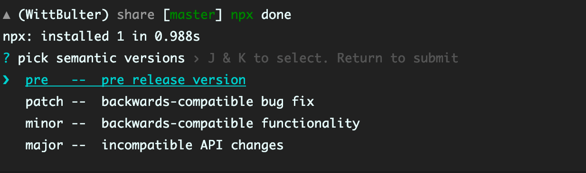

## done

`done` is a command line tool to help standardize release.

just run `npx done`.

### Features

- No dependencies. (15k ~gzip).
- Support multiple remotes.
- Support Hooks.
- Faster running speed.

### Usage

`done` will help you automatically generate a release, follow [SemVer](https://semver.org/) spec.

**Recommended use of NPX**. Please do not download this package. (required npm > 5.2.0, [what is npx](https://blog.npmjs.org/post/162869356040/introducing-npx-an-npm-package-runner).)

```bash
npx done
```


everything is done, it's easy, right?


### Hooks
`done` will look for a file named release.js in the root directory of your project.


```js
// release.js
module.export = (meta: Release.HookMetas): string => {
  if (meta.type === 'patch') {
    return 'fix some bugs'
  }
  return meta.version
}
```

**Hook params**:

```ts
export interface ChangeInfo {
  name: string,
  pluralName: string,
  description: string,
}

export interface HookMetas {
  infos: ChangeInfo,
  type: string,
  version: string,
}
```

### Why

- why use `npx` instead of install?
    1. `done` very small and no dependences (published), the online experience is great.
    2. make your computer cleaner.
    3. conflict with `shell` reservations, if you must download to the global, try `DONE`.

- why can't add files when release?
    1. `done` jsut to help you add tags.
    2. add files requires GitHub(or other) authentication.

- why NPX is so fast?
    1. i used `ncc` pack files, it worked amazingly well.
    2. i use `arg` instead of `commander`.

<br/>

### license
[MIT](LICENSE)
